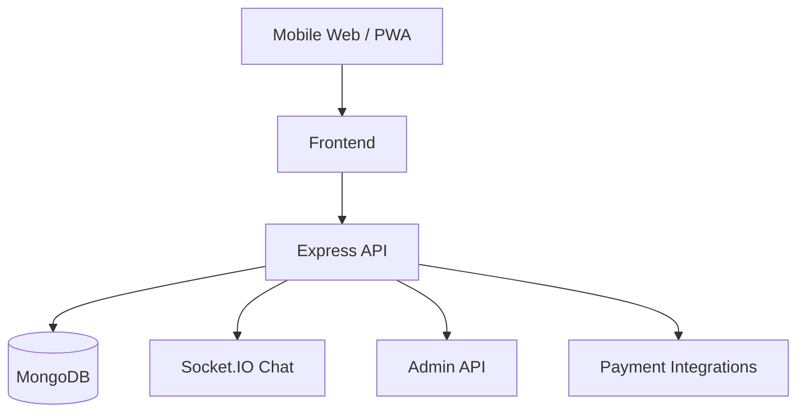

# UstaTop

UstaTop - Uzbekistan uchun lokal xizmatlar marketplace prototipi.

## Strukturasi
- `frontend/` - HTML/CSS/JS mobil-first demo interfeys (Uzbekcha)
- `backend/` - Node.js + Express + MongoDB API skeleti

## 1) Arxitektura (MVP)


## 2) Tez ishga tushirish
### Backend
```bash
cd backend
npm install
npm run dev
```

### Frontend
`frontend/index.html` ni browserda oching.

## 3) Monetizatsiya
1. Har yakunlangan buyurtmadan komissiya (8-15%).
2. Ustalar uchun premium obuna (top listing, analytics, verified boost).
3. High-value kategoriyalarda lead fee.
4. In-app reklama (asbob-uskunalar do'konlari).
5. Qo'shimcha pullik xizmatlar (tezkor verifikatsiya, CRM-lite).

## 4) Hackathon pitch
UstaTop ishonchli ustalarni topishni osonlashtiradi: verifikatsiya qilingan profil, shaffof narxlar, reyting/sharh, geolokatsiyaga asoslangan qidiruv, va tez bron. Platforma mijozlarga xavfsiz tanlov beradi, ustalarga esa barqaror buyurtma oqimini ta'minlaydi. MVP oddiy arxitekturaga ega va commission + subscription model orqali tez monetizatsiya qilinadi.
